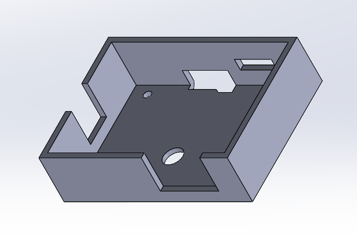

Circuit Board
-------------

I build the whole circuit onto a 70mm x 50mm perfboard. The signals are mostly established with 30 AWG kynar coated wires, that are sewn into the perfboard to avoid snagging.

Microcontroller
---------------

The brains of the circuit is a ESP32 TinyPICO, which is a small form factor development board for the ESP32.

Power Supply
------------

The OBD-II port provides two sources of 12V, one is always on, the other is on when the car is on. I used a two way switch to be able to choose between these two sources. In normal driving situations, the circuit is only powered when the car is on. When I need to do data logging of recharging, I can leave it in always-on mode.

The 12V is stepped down to 5V using a DC/DC buck converter, a generic one from Amazon.

A seperate buck converter is placed next to the LED strip, to avoid losses in the cable.

microSD Card Slot
-----------------

I mounted a microSD card slot to the perfboard by placing it upside down on top of some male header pins. The chassis of the slot is soldered to the male headers to give it rigidity. Since the pins of the slot are too close for the pitch of the perfboard, raising it above the perfboard allows me to solder a 30 AWG wire to each pin individually.

3.3V to 5V conversion
---------------------

The DotStar LED strip uses APA102 LEDs, when powered by 5V, they need 5V on its IO. I used a 74AHCT125 chip to convert 3.3V from the ESP32 to 5V level.

CAN bus
-------

I used a CAN transeiver breakout board to connect to the OBD-II CAN bus. This board has a SN65HVD230 transceiver and the minimum circuitry it needs.

Enclosure
---------

The circuit board is mounted on top of an off-the-shelf OBD-II splitter. This allows me to attach more OBD-II devices later. A 3D printed box protects the circuit.

