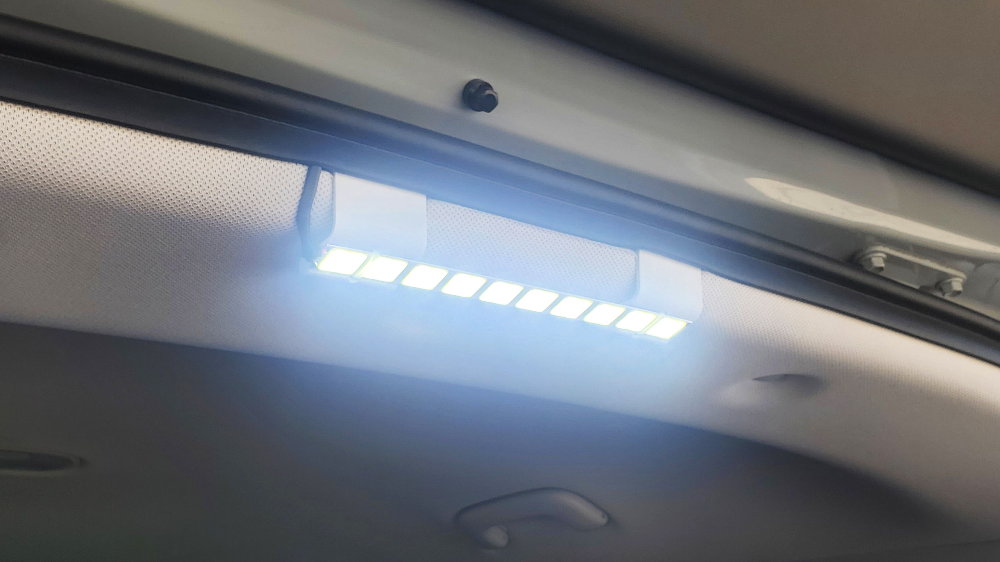
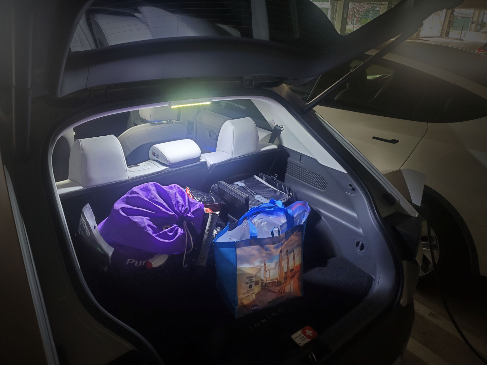
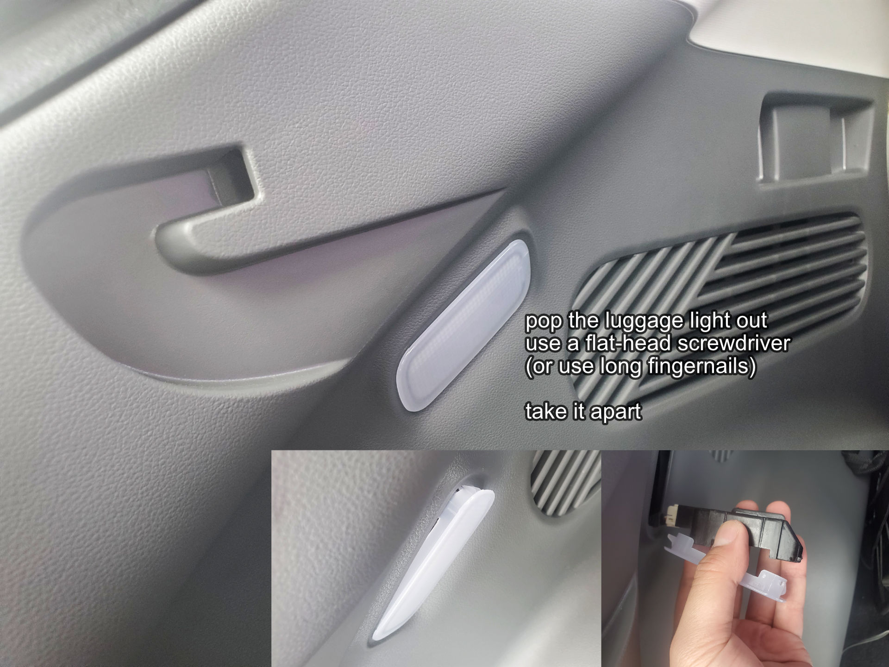
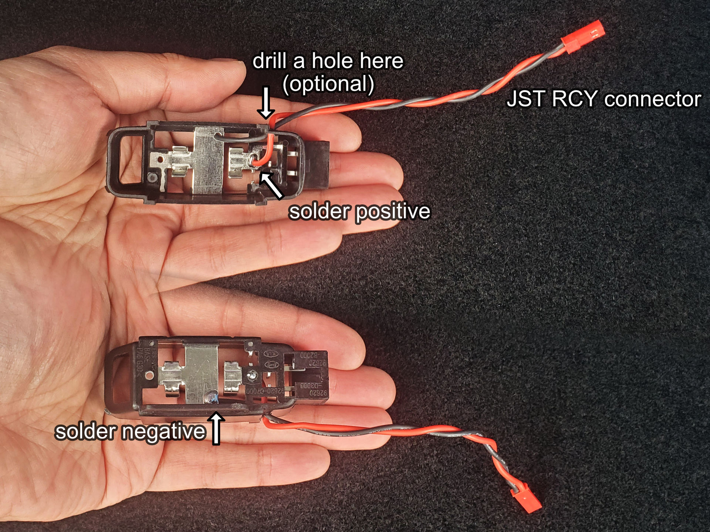
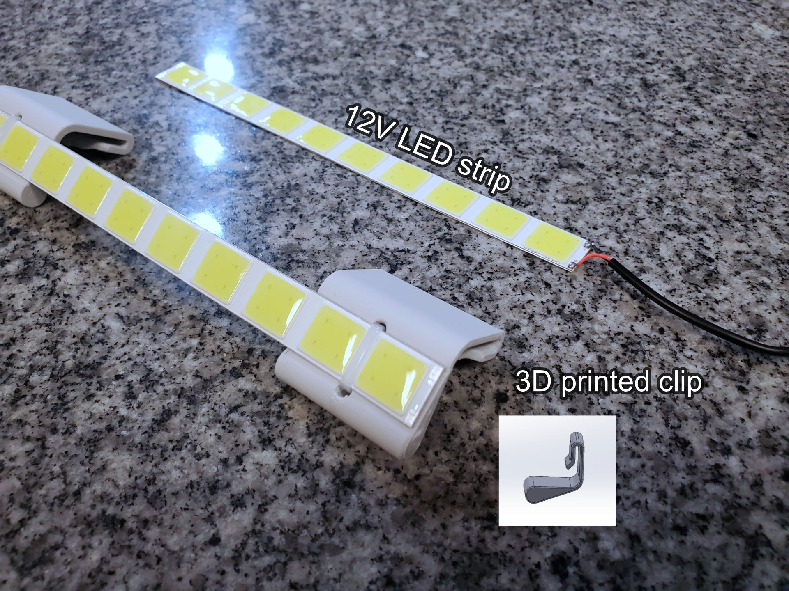
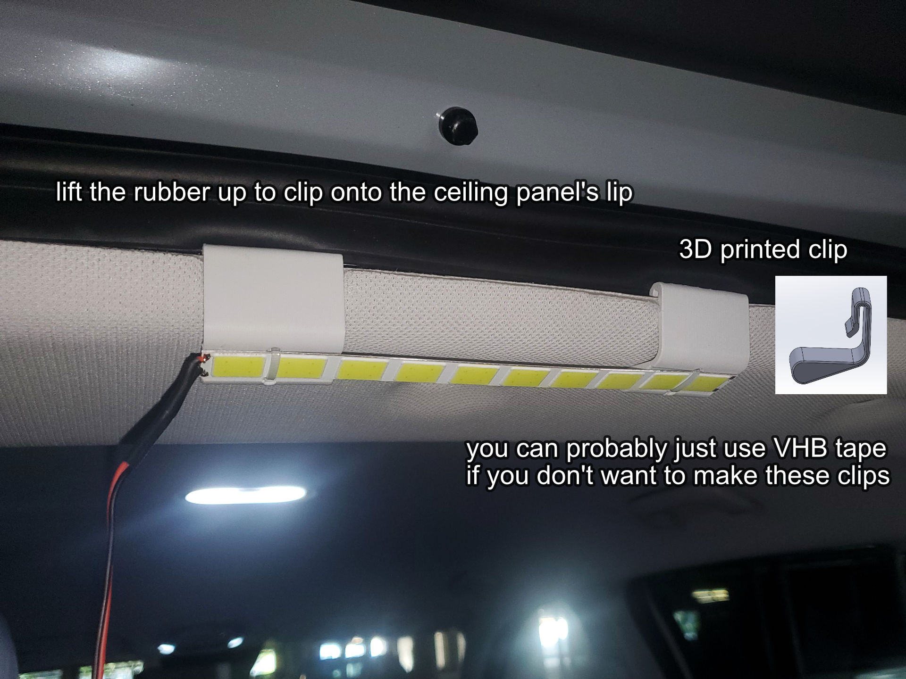
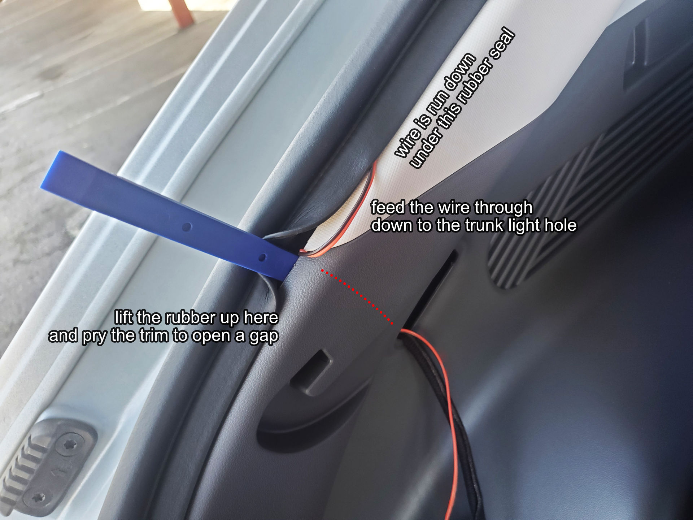
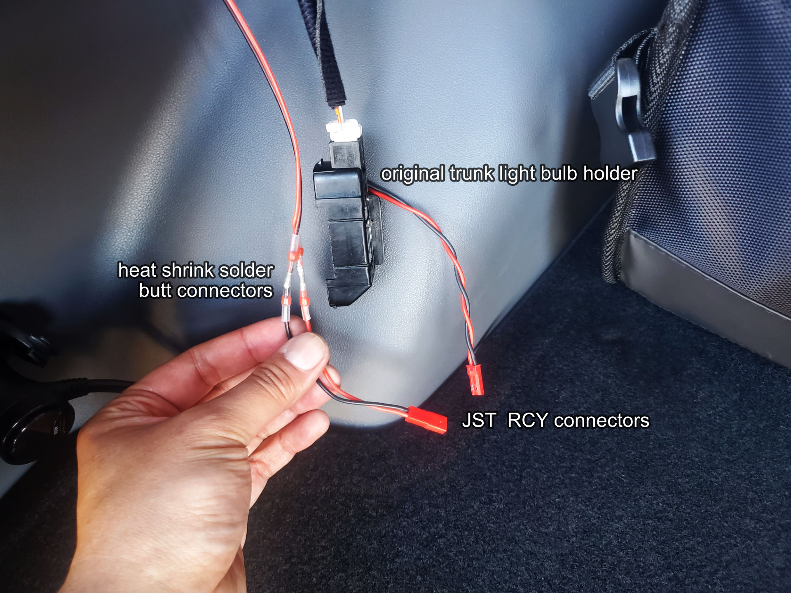

A cheap and non-invasive way of installing a trunk light to the IONIQ 5. The finished look is very clean with no exposed wires. There's no need to remove any of the car's trim panels during installation.

Ideally you have soldering skills and soldering equipment, but if you don't, I will mention alternative methods.

NOTE: All wires should be between 22 AWG and 26 AWG. If you need to use any splices or butt joints, make sure they are designed for wires between 22 AWG and 26 AWG.

Step 1 - Remove Luggage Light
-----------------------------

Simply pop the luggage light out of your car. This can be done with a flat-head screwdriver or a trim removal pry bar.

This should come off easily, there's no risk of breaking anything, the clipping mechanism is fairly beefy and durable.

The light diffuser (the translucent part) and the bulb holder (the black part) should come out. You'll notice some clips holding the light diffuser. Squish on the bulb holder so that these clips release the light diffuser.

Disconnect the cable. Remove the light bulb, simply pry it out with a flat-head screwdriver.

Step 2 - Attach a Connector to the Bulb Holder
----------------------------------------------

Using a soldering iron and solder, solder a JST-RCY female connector to the metalic parts of the bulb holder. Please pay attention to the wire colours, and the polarity (location of the holes, as indicated in the pictures).

ALTERNATIVE: Put a T-tap wire splice on the white and orange wire. The white wire is positive, the orange wire is negative.

WARNING: Please disconnect the car's 12V battery if you are using wire splices.

NOTE: from the car, white wire is positive, orange wire is negative

Step 3 - Prepare the LED Light Bar
----------------------------------

Find a LED light bar that you like, as long as it is powered by 12V, and is specified as 6W or lower. (I think the limit is 10W but I don't want to push my luck, this particular signal is not individually protected by a fuse)

The light bar should have a positive wire (often red) and a negative wire (often black). We need the whole wire to be long enough to go from the top of the trunk, down along the rubber seal, into where the original luggage light goes (use 6 feet please). If the provided wires are not long enough, either extend them or replace them.

Soldering on new wires will get the cleanest look. If you cannot solder, then use heat-shrink solder butt joints, or crimp-on butt joints, or inline wire splices. You will need to hide the bulk above the ceiling instead of under the rubber.

Step 4 - Attach the Light Bar
-----------------------------

Attach the light bar to the ceiling.

For my own installation, I designed and 3D printed some clips that clips to the lip of the car's ceiling panel, and the light bar is zip-tied to these clips. If you do not have access to a 3D printer, you can make clips by bending some aluminum. Or... it is probably OK to just double-side-tape (use VHB tape) the light bar to the ceiling.

Step 5 - Run the Wires
----------------------

Run the wires down the rubber seal, tucking the wires underneat the seal.

There's a point where the plastic trim meets the fabric trim, very close to where the original luggage light was. Use a prying tool to pry a gap open. Feed the wires through here until it comes out of the hole where the original luggage light was.

Step 6 - Finalize Connection
----------------------------

Once the new long wire pokes out of the luggage light hole, attach a JST-RCY male connector to the end, using heat-shrink solder butt joints. Pay attention to the polarity! Connect the JST RCY connectors to together and reconnect the bulb holder back to the car. The LED light strip should turn on.

ALTERNATIVE: If you used a T-tap wire splice, then simply attach the wire splice to the end of the new wire. Pay attention to the polarity!

WARNING: Please disconnect the car's 12V battery if you are using wire splices.

Tuck away all the loose wire into the car, and reattach the original luggage light. You are done. (reconnect the car's 12V battery if you have previously disconnected it)
